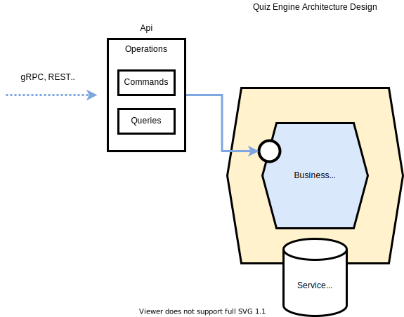

# Architecture

Below is a proposed simple hexagonal architectural solution for the quiz engine. 
It aims at creating loosely coupled application which would allow the backend business logic to be independently
developed of whatever front end and database solution are ultimately decided upon on. 
This makes components exchangeable at any level and facilitates unit and integration testing.

In summary, the plan would be to develop the quiz engine logic (Business Logic) which sits on top of a database solution (Service Database) 
which can be easily swapped out. This would allow development of the core functionality and unit test it against a 
simple mock database. Once a production solution has been decided this connection can be tested with a simple set of
integration tests.

The quiz engine would present a clean public api commands and queries which can be neatly wrapped in an API to the outside world
for clients to communicate with; the front end for example. The loose coupling allows to choose any suitable communication
method such as REST, gRPC, etc..

